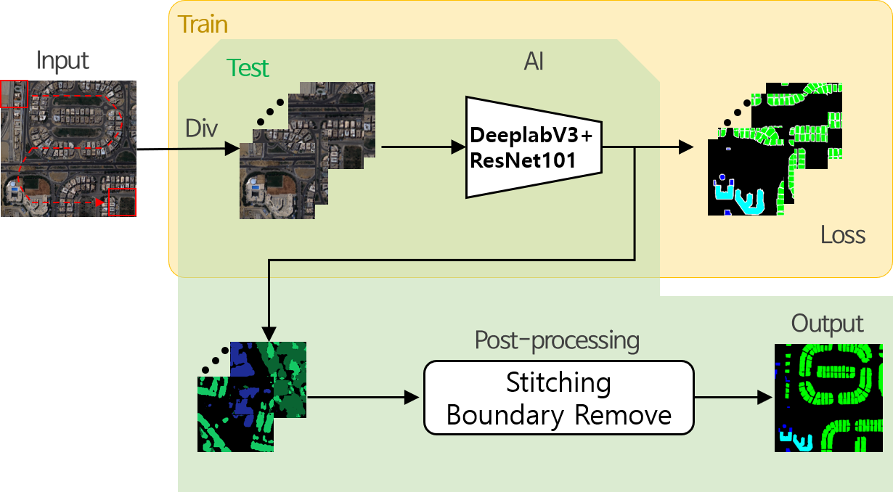
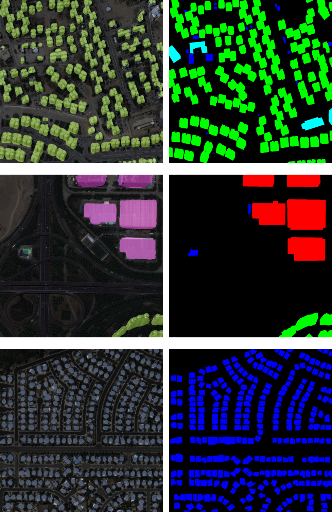

## Building Detection 2020
2020년 국가 위성영상 AI 데이터 구축 사업의 일환으로 만들어진 코드입니다.

## Model


## Dataset Introduction
- Name : KOSDAB (KOrea Multi-Purpose Satelliete imagery DAtaset for Building detection )
- 인공위성: 다목적실용위성 (KOMPSAT) 3호/3A호  (아리랑위성)
- Pixel size: (1024, 1024)
- Classes: 소형시설(1), 아파트(2), 공장(3), 중형단독시설(4), 대형시설(5)
- Label type: geojson (영상의 위/경도, 건물 polygon좌표, classes 등)
- Train file list : list_building_train.csv
- Test file list : list_building_test.csv

====Train 과 Test list 는 밀집지역과 오분류를 제외한 데이터셋으로 구성된 리스트 입니다. (실제 활용 영상 리스트 건물 20만+)====

## Requirement
- torch 1.7
- cuda 11
- etc: scipy, torchvision, numpy, PIL

## preprocessing
- 학습과 테스트 이전에 polygon 형태의 label 파일을 semantic segmentation 형태로 변형
- drawPolygons_github.py 활용

## Train and Test
- 기본 셋팅 이외에 필수로 변경해야 하는 사항에 대해 parser 설명
```
  python train_nia_building_github.py --csv_data=학습데이터셋 리스트 CSV파일 이름 [default='/list_building_train_pub3_modi.csv' ]   
                                      --data_dir=데이터셋 경로     
                                      --img_folder_name=데이터경로 안에 있는 실제 이미지가 들어있는 subfolder의 이름 [default='asset']     
                                      --label_folder_name=데이터경로 안에 있는 실제 라벨링데이터가 들어있는 subfolder의 이름 [default='label_gray_contour_pub3']     
                                      --snapshot_dir=학습된 weight file을 저장하는 경로     
                                      --model_mode=학습할 모델 선택(DeepRes101 / DeepRes50 / DeepFCN101)[default='DeepRes101']
```

```
  python test_nia_building_github.py  --csv_data=테스트데이터셋 리스트 CSV파일 이름 [default='/list_building_test_1386_modi.csv' ]   
                                      --data_dir=데이터셋 경로     
                                      --img_folder_name=데이터경로 안에 있는 실제 이미지가 들어있는 subfolder의 이름 [default='asset']     
                                      --label_folder_name=데이터경로 안에 있는 실제 라벨링데이터가 들어있는 subfolder의 이름 [default='label_seg_gray_withcontour_1386']     
                                      --restore_from=학습된 weight 가 있는 경로
                                      --backbone_name=weight 파일 이름 [ex) 'model.pth]
                                      --model_mode=학습할 모델 선택(DeepRes101 / DeepRes50 / DeepFCN101)[default='DeepRes101']
                                      --results_dir=결과영상 저장 경로
```
- Multi GPU 이용시 train_nia_building_github.py의 40번째 line에 있는 *gpu_device = '0,1,..'* 형태로 원하는 여러 GPU를 잡아주고 204번째 line에 있는 *model=nn.DataParallel(model)* 을 활성화 시키시면 됩니다. (test에도 같은 방법을 적용)


## Results


## Weight file download
- DeeplabV3+ResNet101
- DeeplabV3+ResNet50
- FCN+ResNet101
- LINK: [Download](https://www.dropbox.com/sh/ja28r1tir8varvi/AABEYe4ivQQXYg8ALPSH08TGa/github_weight_files?dl=0&subfolder_nav_tracking=1) 
