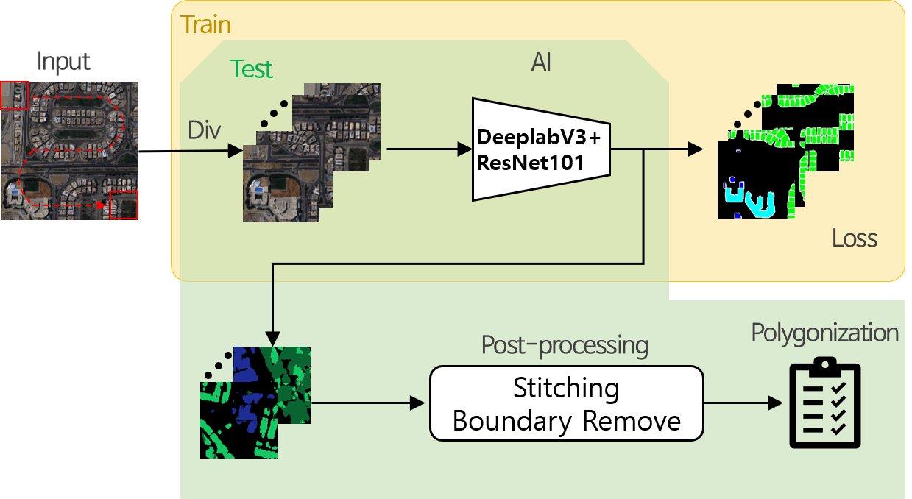

## Building Detection2020
2020년 국가 위성영상 AI 데이터 구축 사업의 일환으로 만들어진 코드입니다.

## Model

## Dataset Introduction
- 인공위성: 다목적실용위성 (KOMPSAT) 3호/3A호  (아리랑위성)
- Pixel size: (1024, 1024)
- Classes: 소형시설(1), 아파트(2), 공장(3), 중형단독시설(4), 대형시설(5)
- Label type: geojson (영상의 위/경도, 건물 polygon좌표, classes 등)

## Requirement
- torch 1.7
- cuda 11
- etc: scipy, torchvision, numpy, PIL

## preprocessing
- 학습과 테스트 이전에 polygon 형태의 label 파일을 semantic segmentation 형태로 변형
- drawPolygons_github.py 활용

## Train and Test
- 기본 셋팅 이외에 필수로 변경해야 하는 사항에 대해 parser 설명
<pre>
<code>
  python train_nia_building_github.py 
  --csv_data=학습데이터셋 리스트 CSV파일 이름 [default='/list_building_train_pub3_modi.csv' ]   
  --data_dir=데이터셋 경로     
  --img_folder_name=데이터경로 안에 있는 실제 이미지가 들어있는 subfolder의 이름 [default='asset']     
  --label_folder_name=데이터경로 안에 있는 실제 라벨링데이터가 들어있는 subfolder의 이름 [default='label_gray_contour_pub3']     
  --snapshot_dir=학습된 weight file을 저장하는 경로     
  --model_mode=학습할 모델 선택(DeepRes101 / DeepRes50 / DeepFCN101)[default='DeepRes101']
</code>
</pre>

## Results

## Weight file download
- DeeplabV3+ResNet101
- DeeplabV3+ResNet50
- FCN+ResNet101
- LINK: https://www.dropbox.com/sh/ja28r1tir8varvi/AADaGnamlFcGO-fZ7mumMQ-aa?dl=0
